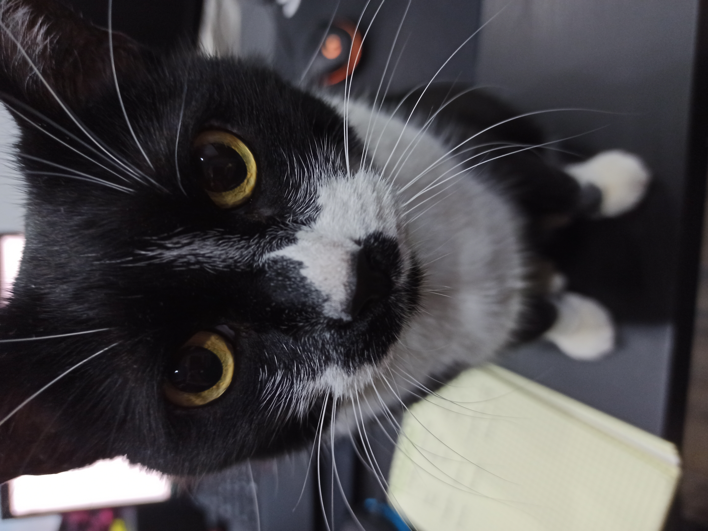

# Go - Discord bot with my cat
```
go run .\pusyabot.go -t {TOKEN}
```

Or build docker image and then run a container, passing your discord bot token:
```
docker run -d --name pusyabot-app bot_image -t {TOKEN}
```

Bot command in Discord: `!pusya`

---
<br/>
<p align="center">
    
</p>

---

### Useful links
[DiscordGo](https://github.com/bwmarrin/discordgo)

[DiscordGo Example](https://github.com/bwmarrin/discordgo/tree/master/examples/dm_pingpong)